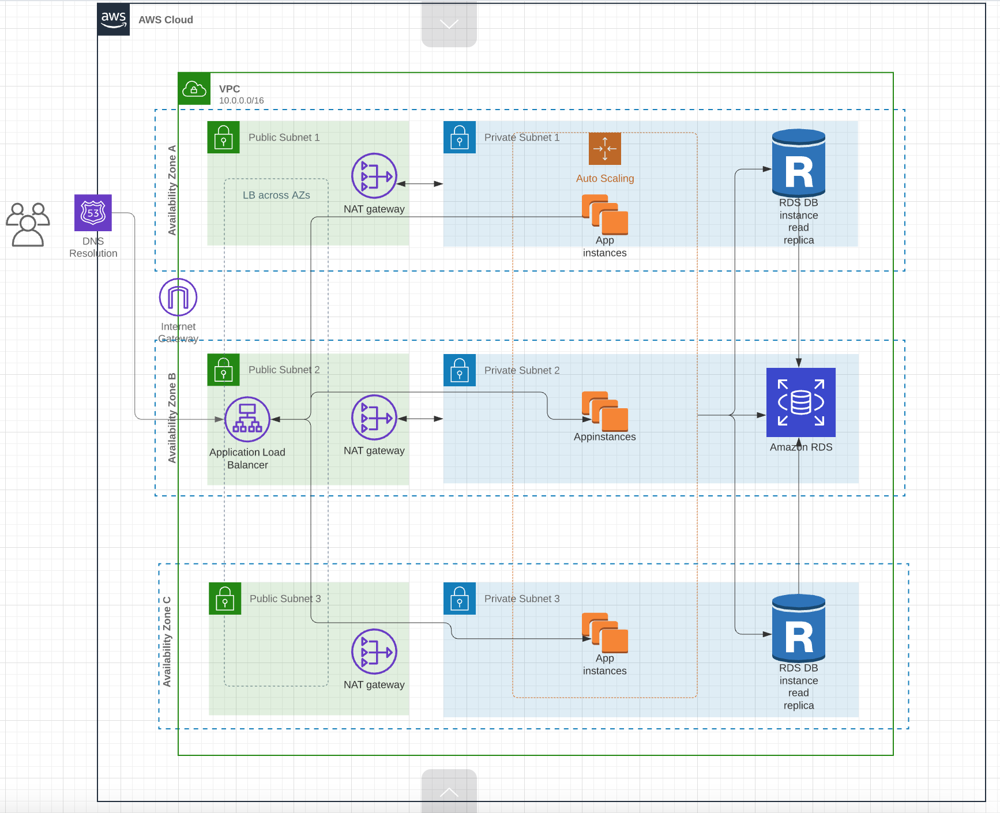

# DevOps_Tasks
##

This is my repo for solving the tasks: Challenge #1 create  architecture for three tier application using TF, Challenge #2 python code for get EC2 metadata, Challenge #3 Python code for get Object from dictionary.

## Challenge#1

```
To be able to use projecte we will need:
- Terraform
- AWS Account
- AWS IAM User with Administrator Permission
```

```
To deploy TF scripts :
1- terraform init
2- terraform validate
3= terraform plan -out terraform.tfplan
4- terraform apply

ps : I'd create three Nat-GWs to match design for HA, but the cost is very high.
```

### AWS Digram is created by lucid tool :

# 
 
```
The diagram in the following link:

https://lucid.app/lucidchart/invitations/accept/inv_e0371ddb-de64-45d8-a9ab-ee8283703715
```

## Challenge#2

The file named script.py under directory task_2 solves the task2 which query the meta data of an instance within aws and provide a json formatted output.
this script must run inside EC2 instance to get it's metadata.
ps: I got a help from GitHub.


## Challenge#2

The file named script.py under directory task_3 solves the task3 which have a nested object, we would like a function that you pass in the object and a key and get back the value.
